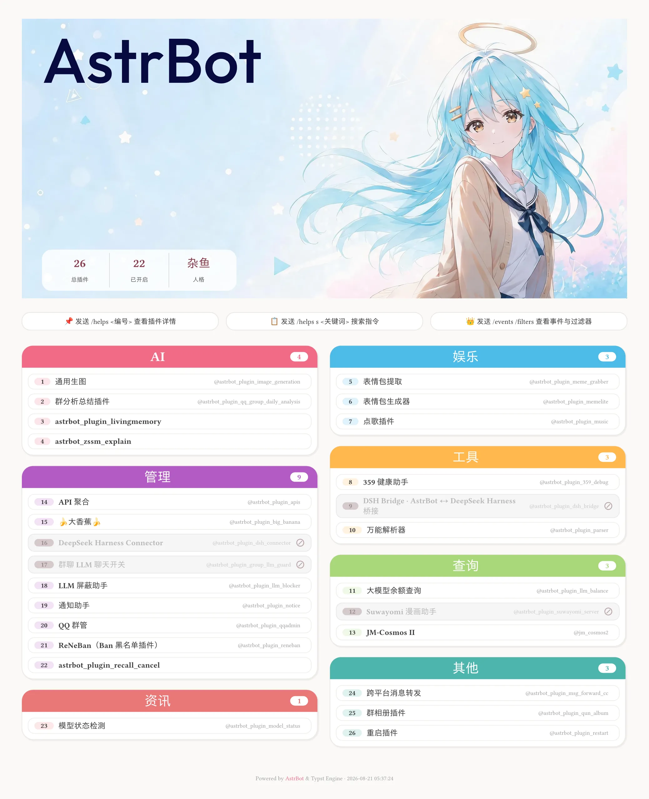
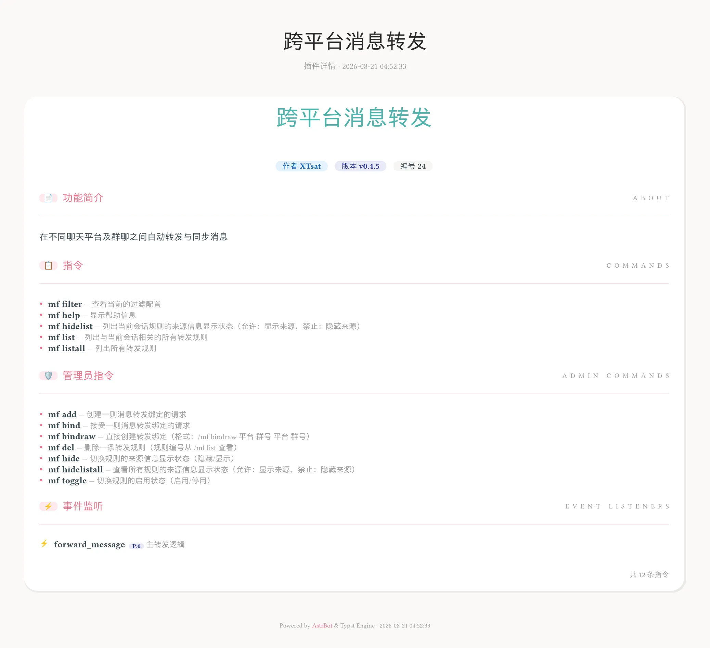
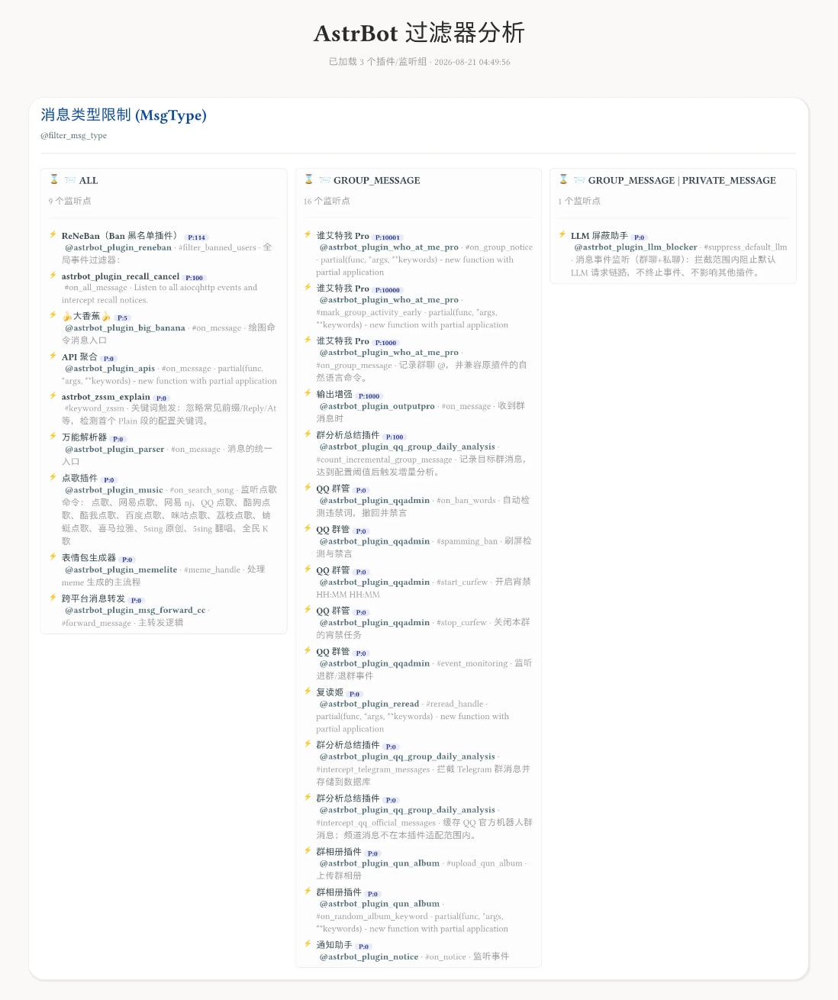
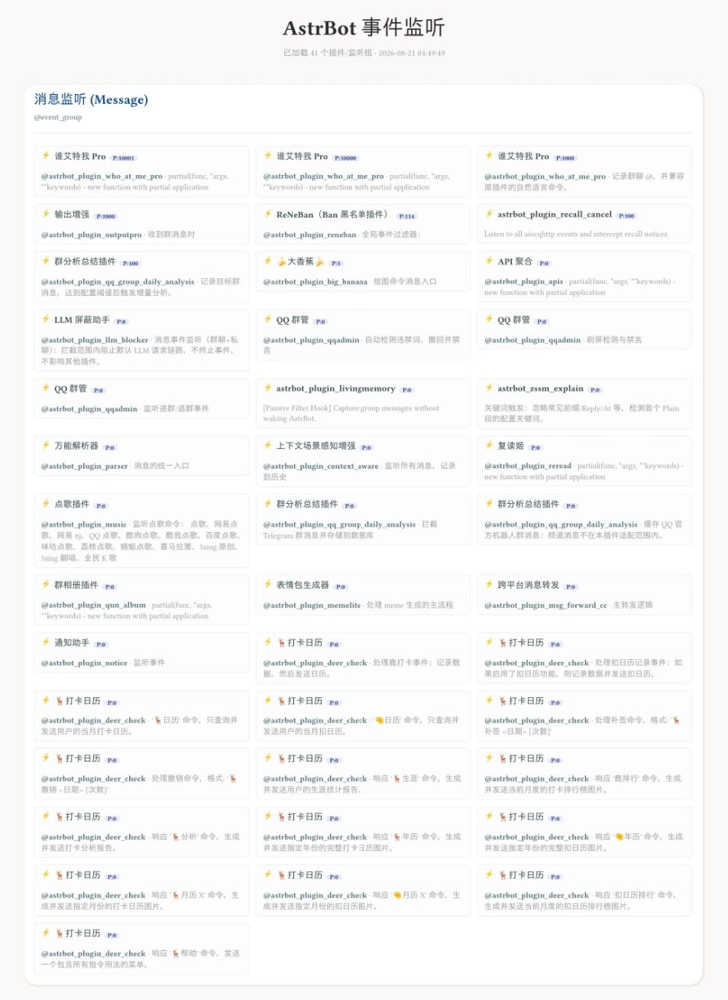

# 📂︎ Astrbot Plugin Help Panel Typst | 插件帮助面板

---

## ✨ 功能

* 基于 [tinkerbellqwq/astrbot_plugin_help](https://github.com/bylkuse/astrbot_plugin_help_typst) 进行特化修改的插件帮助菜单
* 把插件菜单、事件钩子、函数工具、过滤器列表渲染成友好界面。其中 `/helps` 采用现代 Bot Dashboard 风格：顶部白色 Header 卡片（标题 + 统计）与快捷操作按钮，主体为双栏分类卡片，每个分类一张固定主题色卡片（彩色标题栏 + 插件列表 + 编号徽章）；`/events`、`/filters` 仍保留详细的节点与分组信息，可兼作调试辅助工具。
* 已停用（disabled）插件仍会展示在 `/helps` 中，以低饱和灰粉色板降低视觉权重（浅灰卡片、灰粉编号徽章、右侧「圆圈+斜杠」图标），布局与普通插件一致，一眼可辨「存在但当前不可用」。
* 顶部 Hero 品牌模式（默认开启）：把图片放入背景目录（缺省 `.../data/plugin_data/astrbot_plugin_help_typst/backgrounds`，或配置 `background_dir`），`background_random` 默认随机选图；开启后 `/helps` 顶部变为 Hero 横幅——左上官方 AstrBot 文字徽标、左下统计卡片（总插件/已开启，及当前人格名称），右侧预留给背景图角色主视觉，其余区域保持背景可见；关闭或没有背景图时保持经典布局（详见 [🖼️ 顶部 Hero 品牌横幅](#-顶部-hero-品牌横幅)）。
* 内置 5 套主题预设：`Ocean Blue`（明亮清爽）、`Night Navy`（深色科技感）、`Soft Mist`（莫兰迪低饱和）、`Vivid Pop`（高饱和活力）与 `zhenxun`（柔和马卡龙粉彩），在配置面板通过 `appearance.active_preset` 下拉框直接选择即可切换，品牌色板与分类色随之变化；内置预设配色固定锁定，选择「自定义」则使用下方预设列表中的配置（默认提供 `zhenxun` 作为模板，可改名、改色或新增条目）。也可以直接在列表条目中勾选「启用」开关，勾选后立即使用该条目作为自定义配色，无需再切换到上方下拉框的「自定义」；多个条目同时启用时取第一个。
* 针对插件名、指令名、描述内容的泛用搜索工具，附关键词高亮
* `/helps <编号>` 可查看单个插件的详情页（作者/版本/功能简介/管理员指令/普通指令/事件监听）
* 基于 typst 渲染实现，轻量、灵活、高效，你可以使用 typst 语法修改、构建属于自己的渲染模板（WIP）
* 支持自定义字体 .ttf .otf .woff2<br>
  1. 放入 插件目录/resources/fonts 或[自定义字体目录](#-常见问题)<br>
  2. 重载方式三选一(更新 optional scheme)<br>
     1. 在 AstrBot 面板中重载插件<br>
     2. 重启 AstrBot<br>
     3. 使用指令 typst font<br>
  3. 新字体将会出现在配置面板的全局字体配置（`appearance.font_order`）中供勾选排序，不可用的字体会被自动剔除<br>
   4. 系统字体库也会被自动扫描进选择框（Windows/macOS/Linux 常见字体目录），也可直接输入字体名

### 🖼️ 功能预览

| `插件菜单` | `搜索` |
| :---: | :---: |
|  | </br> |

| `过滤器` | `事件监听器` |
| :---: | :---: |
|  |  |

## 📖 指令使用

### 基本用法

| 指令 | 说明 |
| :--- | :--- |
| `/helps` | 显示插件卡片式帮助面板 |
| `/helps <编号>` | 查看指定插件的详情页（作者/版本/简介/管理员指令/普通指令/事件监听） |
| `/helps s <关键词>` | 搜索指令（按关键词高亮匹配） |
| `/events` | 显示事件监听列表 |
| `/events s <关键词>` | 搜索事件监听 |
| `/filters` | 显示过滤器详情 |
| `/filters s <关键词>` | 搜索过滤器 |
| `/typst font` | 扫描字体并重载插件（管理员权限） |

### 别名

| 主指令 | 别名（效果等同） |
| :--- | :--- |
| `/helps` | `/帮助`、`/菜单`、`/功能` |
| `/events` | `/事件`、`/事件监听` |
| `/filters` | `/过滤器`、`/过滤` |

## 🏷️ 插件分类规则

`/helps` 按插件元信息（`desc` / `name` / `display_name` / `tags`）中的关键词自动归类：命中第一个匹配的分类即归入该分类，全部未命中则归入「其他」。

> 下表顺序即匹配优先级（从上到下）。关键词以 `domain/constants.py` 的 `CATEGORY_KEYWORDS` 为准，修改后请同步更新此表。「主题色」为默认预设 `zhenxun` 的配色，切换预设后随主题变化。

| 分类 | 主题色 | 匹配关键词 |
| :--- | :--- | :--- |
| 查询 | 浅绿 `#A8D77A` | 查询、搜索、百科、词典、翻译、天气、汇率、快递、新闻、热搜、日历、黄历、search、query、wiki、translate、weather |
| 娱乐 | 天蓝 `#4DBCE8` | 娱乐、游戏、抽奖、点歌、音乐、笑话、梗图、表情包、随机、运势、签到、塔罗、占卜、骰子、game、music |
| 工具 | 橙 `#FFB84D` | 工具、计算、转换、二维码、短链、短网址、解析、压缩、编码、tool、qrcode |
| 管理 | 紫 `#B45BC5` | 管理、群管、禁言、踢人、审核、权限、撤回、违禁词、黑名单、风控、admin、ban |
| 资讯 | 珊瑚红 `#E97878` | 资讯、订阅、推送、通知、提醒、播报、监控、rss、news、feed |
| AI | 粉 `#F16B86` | ai、llm、模型、gpt、大模型、对话、智能、画图、绘图、文生图、图像、绘画、image、diffusion |
| 调试 | 玫粉 `#F36F88` | 调试、开发、测试、日志、诊断、debug、dev |
| 其他 | 青绿 `#4DB5AD` | 兜底：未命中任何关键词时归入 |

## 🖼️ 顶部 Hero 品牌横幅

`/helps` 顶部支持 **Hero 品牌模式**（`hero_header`，**默认开启**）：检测到背景图后，顶部变为 Hero 横幅——左上为**官方 AstrBot 文字徽标**，**左下为半透明白色统计卡片**（总插件 / 已开启，数字与标签整体垂直居中；第三列自动显示**当前人格名称**（AstrBot 人格系统），未配置人格时不显示该列），**右侧预留给背景图角色主视觉**，整卡按图片原始比例展示背景；关闭 `hero_header` 或没有背景图时恢复经典白色卡片布局。

背景图放在**背景目录**中，插件只扫描该目录根下的图片（`.png/.jpg/.jpeg/.webp/.bmp/.gif`，排除 `cache_`、`temp_` 开头的文件）。目录来源：

1. **自定义背景目录**：配置 `background_dir` 为绝对路径（优先）。
2. **默认背景目录**（推荐）：缺省 `.../data/plugin_data/astrbot_plugin_help_typst/backgrounds`，直接把图片放进去即可，无需配置。

> 插件安装时，`resources/images/` 中的内置图片（`.png/.jpg/.jpeg/.webp/.bmp/.gif` 格式）**自动导入**到默认背景目录；已存在的文件不会被覆盖，用户后可自行替换或增删。

可选配置：

- `background_random`（**默认开启**）：每次渲染从背景目录**随机选一张**；关闭时取文件名排序第一张。
- `header_background`：显式指定单个图片文件（绝对路径），优先级最高，设置后直接使用该图（不走随机）。
- `hero_header`：Hero 品牌模式开关（默认开启）。

说明：

- 背景图变更（新增/删除/替换）会自动触发重新渲染（已纳入缓存校验），无需手动清缓存。
- 随机模式下每次渲染会重新随机选图（缓存随之失效并重绘）。
- 横幅文字颜色会自动压深以保证在浅色背景图上可读（不受深色主题影响）。

## ❓ 常见问题

### Typst 字体优先级

文档显式指定 > 项目字体目录 > 系统字体库

* 文档显式指定：通过 #set text(font: "font-family-name") 直接指定，优先级最高
* 项目字体目录：即本插件的根目录下的 ./resources/fonts <br>
~~后面会考虑增加额外的目录支持~~已完成，缺省值为 `.../data/plugin_data/astrbot_plugin_help_typst/fonts` 🚨 docker 用户记得确保自定义字体目录已被挂载
* 系统字体库：自动扫描并收录进 `appearance.font_order` 选择框（Windows: `C:/Windows/Fonts`；macOS: `/System/Library/Fonts`、`/Library/Fonts`、`~/Library/Fonts`；Linux: `/usr/share/fonts`、`/usr/local/share/fonts` 等）🚨 docker 环境可能没有系统字体，需要把字体放入自定义字体目录或安装字体依赖）

## 🌳 目录结构（初步预期）

```
astrbot_plugin_typst_menu/
├── main.py                # [入口] AstrBot 插件主文件，注册指令和事件，转发给 core
├── domain/                # [数据定义层] (最底层，无依赖)
│    ├── constants.py          # 存储 “魔术数字” 统一于此维护调试
│    ├── config.py             # 配置结构
│    └── schemas.py            # Pydantic Models & TypedDicts
├── utils/                 # [通用工具层] (各类公开可复用的静态方法)
│    ├── hash.py               # hash
│    ├── font.py               # 字体扫描 & 管理
│    ├── image.py              # 图片处理
│    └── views.py              # [视图层] 处理通过指令组管理和调试插件时展示给用户的格式化文本
├── core/                  # [核心业务层] (纯 Python 逻辑)
│    ├── analyzer.py           # 获取、组织数据
│    ├── renderer.py           # 渲染调度
│    └── worker.py             # 进程调用（即用即销）
├── templates/             # Typst 模板文件
│    └── base.typ              # 基础库文件 (类似 CSS Reset)
└── resources/             # 静态资源
     ├── fonts/                # 内置开源中文字体
     └── images/               # 内置图片（安装时自动导入到 backgrounds 目录）

```
