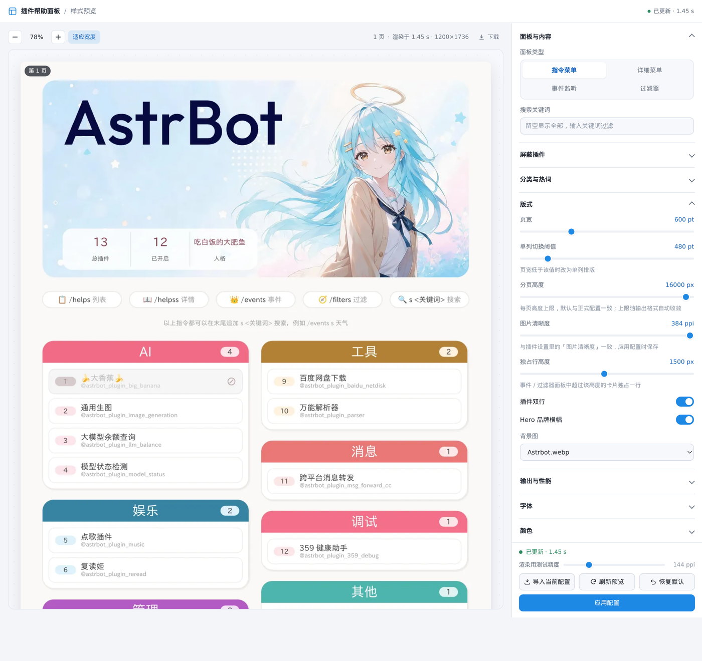

<div align="center">

# 📂 Astrbot 插件帮助面板

把 AstrBot 的插件、指令、事件监听与过滤器，渲染成一张分类卡片式长图。

</div>

装上 AstrBot 后，插件越装越多，`/help` 越来越难看清有哪些功能。本插件把全站插件与指令做成一张带分类配色的长图：**每个插件一张卡片，全局连续编号**，还能按关键词搜索、点编号看单个插件详情、单独查事件监听与过滤器。支持 4 套内置主题、Hero 品牌横幅、自定义背景图与字体，也能在 AstrBot 网页里实时调样式。

## 效果预览

| 插件菜单（Hero 横幅） | 网页样式预览 |
| :---: | :---: |
|  |  |

| 搜索高亮 | 插件详情 |
| :---: | :---: |
|  |  |

| 事件监听 | 过滤器 |
| :---: | :---: |
|  |  |

## 特性

- **卡片式面板**：分类卡片 + 全局编号，配色跟随主题自动分配。
- **三种视角**：指令菜单（`/helps`）、详细面板（`/helpss`，展开指令与参数）、插件详情（`/helps <编号>`）。
- **搜索高亮**：`s <关键词>` 按插件名、指令、别名、描述搜索，命中处高亮。
- **事件与过滤器**：`/events`、`/filters` 各成一张图，同样支持搜索。
- **Hero 横幅**：有背景图时顶部显示徽标与统计（总插件 / 已开启 / 当前人格名）。
- **4 套主题**：真寻、墨竹、落日、夜鸢，也能自建配色模板。
- **版式可调**：页宽、单列阈值、插件双行、清晰度、图片格式均可调；超出高度自动分页。
- **网页样式预览**：在 WebUI 里边调边看，一键应用。

## 快速开始

1. 在 AstrBot 插件市场搜索 **插件帮助面板** 安装，或把仓库放进 `data/plugins/`；
2. 重启 AstrBot（或在插件管理里重载），依赖会自动安装；
3. 发送 `/helps`。

需要 **AstrBot 4.9.2+**；网页样式预览页需要 **4.24.2+**。

## 指令

| 命令 | 权限 | 说明 |
| :--- | :--- | :--- |
| `/helps` | 所有人 | 卡片式帮助面板 |
| `/helps <编号>` | 所有人 | 插件详情：作者、版本、简介、指令与事件监听 |
| `/helps s <关键词>` | 所有人 | 搜索插件与指令 |
| `/helpss` | 所有人 | 详细面板，插件下展开指令与参数（同样支持 `<编号>` 与 `s <关键词>`） |
| `/events` | 所有人 | 事件监听与函数工具列表（可 `s <关键词>`） |
| `/filters` | 所有人 | 过滤器列表（可 `s <关键词>`） |
| `/typst font` | 管理员 | 扫描字体并重载插件 |

别名：`/helps` = `/帮助`、`/菜单`、`/功能`；`/helpss` = `/详细帮助`、`/详细功能`、`/详细菜单`；`/events` = `/事件`、`/事件监听`；`/filters` = `/过滤器`、`/过滤`。

```
/helps                # 帮助面板
/helps 12             # 编号 12 的插件详情
/helps s 天气          # 搜索「天气」相关插件与指令
/typst font           # 管理员：重新扫描字体
```

> 编号取自面板上的徽章；`s` 开头一律按搜索处理，`/helps s 2048` 不会跳到编号 2048。

## 配置

配置项在 AstrBot WebUI 的插件设置里，下表的默认值与面板一致。

<details>
<summary><b>基础</b></summary>

| 配置项 | 默认值 | 说明 |
| :--- | :--- | :--- |
| 启用等待提示（`enable_waiting_message`） | 关闭 | 出图前先发「正在渲染…」，发出后自动撤回 |
| 屏蔽插件（`ignored_plugins`） | AstrBot 本体、内置指令组、本插件 | 勾选不在面板展示的插件 |
| 自定义屏蔽插件名（`ignored_plugins_custom`） | 内置服务插件与本插件旧名 | 每行一个插件名，屏蔽未安装或改过名的插件 |
| 自定义字体目录（`custom_font_path`） | 空 | 绝对路径；留空用数据目录下的 `fonts` |

</details>

<details>
<summary><b>渲染与输出</b></summary>

| 配置项 | 默认值 | 说明 |
| :--- | :--- | :--- |
| 图片清晰度（`ppi`） | 256 | 越高越清晰、越慢越大（72~384） |
| 页面总宽度（`page_width`） | 600 | 面板宽度，单位 pt（360~1200），调窄后文字相对更大 |
| 单列切换阈值（`single_column_threshold`） | 480 | 页宽低于此值改为单列；设成不小于页宽即强制单列 |
| 插件双行模式（`plugin_two_lines`） | 开启 | 把插件行右侧的英文 ID 移到中文名下方 |
| 发送图片格式（`output_format`） | `webp` | `webp` 体积最小；`png` 无损但更大；`jpeg` 居中 |
| 分页高度（`split_height`） | 16000 | 每页高度上限（200~65500），上限按输出格式自动收敛 |
| 巨型块阈值（`giant_threshold`） | 1500 | 事件 / 过滤器面板中超高的卡片独占一行（100~3000） |
| 数据生成超时（`timeout_analysis`） | 10 | 生成面板数据的超时秒数（3~60） |
| Typst 编译超时（`timeout_compile`） | 30 | 生成图片的超时秒数（3~60） |
| 最大并发编译数（`max_concurrent_tasks`） | 2 | 同时出图的任务上限（1~10） |

</details>

<details>
<summary><b>外观与配色</b></summary>

| 配置项 | 默认值 | 说明 |
| :--- | :--- | :--- |
| 当前使用的样式预设（`active_preset`） | `zhenxun`（真寻） | 真寻 / 墨竹 / 落日 / 夜鸢 / 自定义 |
| 主题预设列表（`presets`） | 1 条「自定义」 | 编辑品牌色、10 个分类色槽与通用颜色 |
| 字体优先级排序（`font_order`） | `LXGW Neo XiHei` | 全局字体顺序，可多选排序 |
| 重新扫描字体（`rescan_fonts`） | 关闭 | 勾选保存后扫描一次字体并刷新选项，随后自动关闭 |

内置主题只读：在样式预览页改内置主题的颜色，会自动转存到「自定义」模板。

</details>

<details>
<summary><b>Hero 横幅与背景图</b></summary>

| 配置项 | 默认值 | 说明 |
| :--- | :--- | :--- |
| Hero 品牌模式（`hero_header`） | 开启 | 关闭后回到经典白色卡片布局 |
| 背景图随机选择（`background_random`） | 开启 | 每次随机取一张；关闭取排序第一张，指定单张可秒开 |
| 顶部 Header 背景图（`header_background`） | 空 | 指定单张图片的绝对路径，优先级最高 |
| 背景图目录（`background_dir`） | 空 | 自定义背景目录；留空用数据目录下的 `backgrounds` |

把图片放进背景目录即可使用，取目录根层的 `.png/.jpg/.jpeg/.webp/.gif`；新增、替换、删除后自动重新出图。

</details>

<details>
<summary><b>插件分类规则</b></summary>

- **分类规则列表**（`rules`）：每条 = 分类名称 + 匹配关键词 + 启用开关 + 主题色，可增删改排序。
- **兜底分类**（`fallback`）、**兜底分类颜色**（`fallback_color`）：默认「其他」，可改名改色。
- **主题色**：`slot_0`~`slot_9` 跟随主题换色，`#RRGGBB` 固定颜色，留空自动分配。

默认分组：调试、管理、娱乐、消息、AI、查询、工具，外加兜底「其他」。

已保存的分类规则不会被升级覆盖；想用新版默认分组，在样式预览页点「套用标准分类」。

</details>

**字体**：优先级为模板指定 > 项目字体目录 > 系统字体库，支持 `.ttf/.otf/.woff2`。内置字体之外，可把字体放进「自定义字体目录」；🚨 Docker 或精简系统常常没有系统字体，请放自定义目录。新字体没出现在选择框时，在样式预览页点「重新加载字体」，或勾选「重新扫描字体」，或执行 `/typst font`。

## 许可与鸣谢

- 许可证：[AGPL-3.0](./LICENSE)
- 鸣谢：[bylkuse/astrbot_plugin_help_typst](https://github.com/bylkuse/astrbot_plugin_help_typst)，以及所有依赖项目的作者。
